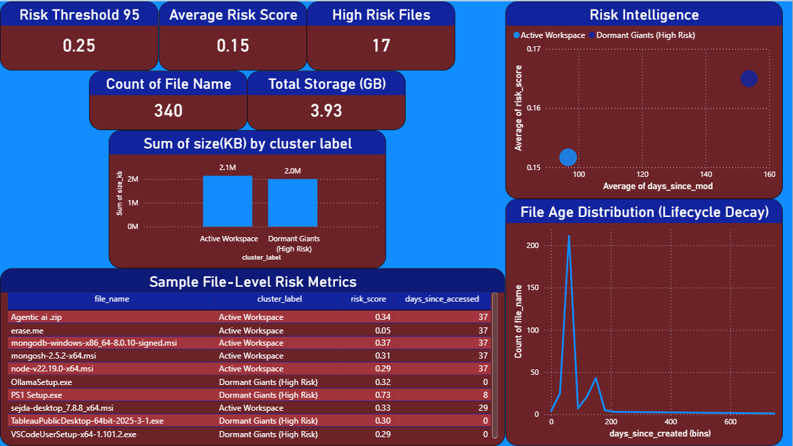

# 📁 File System Risk Intelligence & Analytics

An end-to-end data intelligence system that analyzes file-system metadata,
identifies high-risk dormant files using machine learning, and explains
decisions through an interactive Power BI dashboard.

---

## 🚀 Problem Statement
Modern systems accumulate thousands of files over time. Identifying
unused, high-risk, and storage-heavy files manually is inefficient.
This project automates file risk assessment using behavioral analytics
and unsupervised learning.

---

## 🧠 Solution Overview
This system:
- Extracts file metadata from a directory
- Engineers behavioral features (age, access, size)
- Uses K-Means clustering to detect usage patterns
- Computes a percentile-based Risk Score
- Visualizes insights using Power BI

---

## 🎯 Key Insight

This project treats files as behavioral entities rather than static objects.
By combining access patterns, age, and storage impact, the system identifies
which files are statistically risky to retain — enabling informed cleanup,
archival, or compliance decisions.

---

## 🏗️ Architecture
Metadata Extraction → Feature Engineering → ML Clustering → Risk Scoring → CSV Persistence → Power BI Dashboard

> Note: All business logic, feature engineering, and risk computation are performed in Python. Power BI is used strictly for visualization and decision analysis.


---

## 🔬 Machine Learning
- Algorithm: K-Means Clustering
- Features: File age, access recency, size, path depth
- Validation: Silhouette Score
- Risk Definition: 95th percentile adaptive threshold

---

## 📊 Dashboard Highlights
- High Risk File Count
- Storage Impact by Cluster
- Behavioral Risk Intelligence
- File Lifecycle Decay Analysis

📸 **Dashboard Preview**


---

## 📁 Repository Structure

```text
file-risk-intel/
├── data/
│   ├── intelligence_report.csv      # Raw + enriched analytical dataset
│   └── intelligence_summary.json    # Executive summary & model metrics
│
├── dashboards/
│   ├── powerbi_dashboard.pbix       # Power BI dashboard
│   └── dashboard_preview.png        # Dashboard screenshot
│
├── src/
│   ├── extractor.py                 # Metadata extraction
│   ├── processor.py                 # Feature engineering
│   ├── analyzer.py                  # Clustering & risk scoring
│   └── visualizer.py                # Visualization logic
│
├── config.yaml                      # Configurable system parameters
├── main.py                          # Pipeline entry point
├── requirements.txt                 # Python dependencies
├── README.md                        # Project documentation
└── .gitignore

---

## ▶️ How to Run
```bash
pip install -r requirements.txt
python main.py
```
---

## 🧾 Output Artifacts

* intelligence_report.csv – BI-ready dataset
* intelligence_summary.json – executive insights
* system_risk_audit.png – static visualization
* Power BI dashboard

---

## 💼 Skills Demonstrated

- Data Engineering with Python
- Feature Engineering & Statistical Thresholding
- Unsupervised Learning (Clustering)
- Explainable Risk Scoring
- Business Intelligence with Power BI
- End-to-End Analytics System Design


---

## 📌 Author

Manotosh Mandal